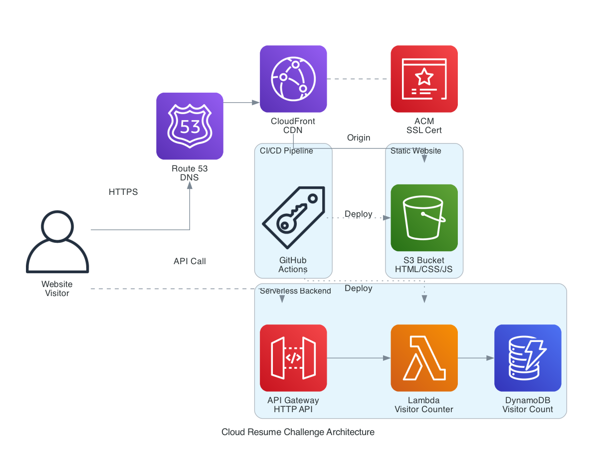

# ☁️ Cloud Resume Challenge

A full-stack serverless resume website built on AWS, following the [Cloud Resume Challenge](https://cloudresumechallenge.dev/).



## 🏗️ Architecture

| Component | Technology | Purpose |
|-----------|-----------|---------|
| **Frontend** | HTML/CSS/JS | Static resume website |
| **Hosting** | S3 | Static website storage |
| **CDN** | CloudFront | Global content delivery |
| **DNS** | Route 53 | Custom domain routing |
| **SSL** | ACM | HTTPS certificate |
| **API** | API Gateway (HTTP) | REST endpoint for visitor counter |
| **Backend** | Lambda (Python) | Visitor count logic |
| **Database** | DynamoDB | Visitor count storage |
| **IaC** | Terraform | Infrastructure provisioning |
| **CI/CD** | GitHub Actions | Automated deployments |

## 📁 Project Structure

```
cv_page/
├── frontend/                  # Static website files
│   ├── index.html            # Resume HTML
│   ├── styles.css            # Styling
│   ├── script.js             # Visitor counter & interactions
│   └── error.html            # 404 error page
├── backend/                   # Serverless backend
│   ├── lambda/
│   │   └── visitor_counter.py # Lambda function
│   └── tests/
│       └── test_visitor_counter.py
├── infra/                     # Terraform infrastructure
│   ├── main.tf               # Provider & backend config
│   ├── variables.tf          # Input variables
│   ├── outputs.tf            # Output values
│   ├── s3.tf                 # S3 bucket
│   ├── cloudfront.tf         # CloudFront distribution
│   ├── route53.tf            # DNS records
│   ├── acm.tf                # SSL certificate
│   ├── dynamodb.tf           # DynamoDB table
│   ├── lambda.tf             # Lambda function
│   ├── api_gateway.tf        # API Gateway
│   └── terraform.tfvars.example
├── .github/workflows/         # CI/CD pipelines
│   ├── deploy-frontend.yml   # Frontend → S3 + CloudFront
│   ├── deploy-backend.yml    # Lambda test & deploy
│   └── terraform.yml         # Terraform plan & apply
├── generated-diagrams/        # Architecture diagrams
└── README.md
```

## 🚀 Getting Started

### Prerequisites

- [AWS CLI](https://aws.amazon.com/cli/) configured with appropriate credentials
- [Terraform](https://www.terraform.io/downloads) >= 1.5.0
- A registered domain with Route 53 hosted zone
- Python 3.12+ (for Lambda development)

### 1. Configure Variables

```bash
cd infra
cp terraform.tfvars.example terraform.tfvars
```

Edit `terraform.tfvars` with your values:
```hcl
aws_region     = "us-east-1"
domain_name    = "resume.yourdomain.com"
hosted_zone_id = "Z0123456789ABCDEFGHIJ"
project_name   = "cloud-resume"
environment    = "prod"
```

### 2. Deploy Infrastructure

```bash
cd infra
terraform init
terraform plan
terraform apply
```

### 3. Update Frontend API Endpoint

After Terraform apply, copy the `api_endpoint` output and update `frontend/script.js`:

```javascript
const API_ENDPOINT = "https://xxxxx.execute-api.us-east-1.amazonaws.com/prod/visitor-count";
```

### 4. Deploy Frontend

```bash
aws s3 sync frontend/ s3://$(terraform -chdir=infra output -raw s3_bucket_name) --delete
aws cloudfront create-invalidation \
  --distribution-id $(terraform -chdir=infra output -raw cloudfront_distribution_id) \
  --paths "/*"
```

### 5. Visit Your Site

```bash
terraform -chdir=infra output custom_domain_url
```

## 🔄 CI/CD Pipeline

### GitHub Repository Secrets Required

| Secret | Description |
|--------|-------------|
| `AWS_ROLE_ARN` | IAM role ARN for OIDC authentication |
| `S3_BUCKET_NAME` | S3 bucket name (from Terraform output) |
| `CLOUDFRONT_DISTRIBUTION_ID` | CloudFront distribution ID |
| `LAMBDA_FUNCTION_NAME` | Lambda function name |

### Setting Up OIDC Authentication

1. Create an IAM OIDC identity provider for GitHub Actions
2. Create an IAM role with appropriate permissions
3. Add the role ARN as `AWS_ROLE_ARN` secret in GitHub

### Pipeline Triggers

| Workflow | Trigger | Action |
|----------|---------|--------|
| **Frontend** | Push to `main` (frontend/) | Sync to S3, invalidate CloudFront |
| **Backend** | Push to `main` (backend/) | Run tests, deploy Lambda |
| **Backend** | PR to `main` (backend/) | Run tests only |
| **Terraform** | Push to `main` (infra/) | Plan + Apply |
| **Terraform** | PR to `main` (infra/) | Plan only |

## 🧪 Running Tests

```bash
# Install test dependencies
pip install pytest boto3 moto

# Run tests
python -m pytest backend/tests/ -v
```

## 🔒 Security Features

- **S3**: All public access blocked; CloudFront OAC for secure origin access
- **CloudFront**: TLS 1.2+ only, HTTPS redirect, SNI
- **DynamoDB**: Server-side encryption, point-in-time recovery
- **Lambda**: Least-privilege IAM policy (only UpdateItem/GetItem on specific table)
- **API Gateway**: CORS configured for specific domain only
- **CI/CD**: OIDC authentication (no long-lived AWS keys)

## 💰 Cost Estimate

This project uses AWS free tier eligible services:
- **S3**: Free tier covers 5GB storage, 20K GET requests/month
- **CloudFront**: 1TB data transfer, 10M requests/month free
- **Lambda**: 1M requests, 400K GB-seconds/month free
- **DynamoDB**: 25GB storage, 25 RCU/WCU free (on-demand)
- **Route 53**: ~$0.50/month for hosted zone
- **ACM**: Free for public certificates

**Estimated monthly cost: ~$0.50** (just the Route 53 hosted zone)

## 📝 License

This project is open source and available under the [MIT License](LICENSE).
